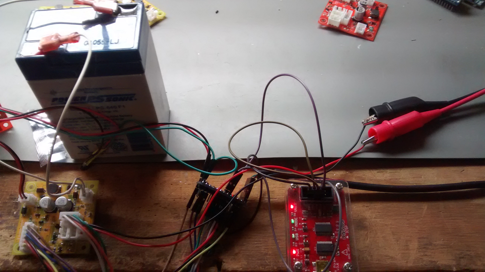
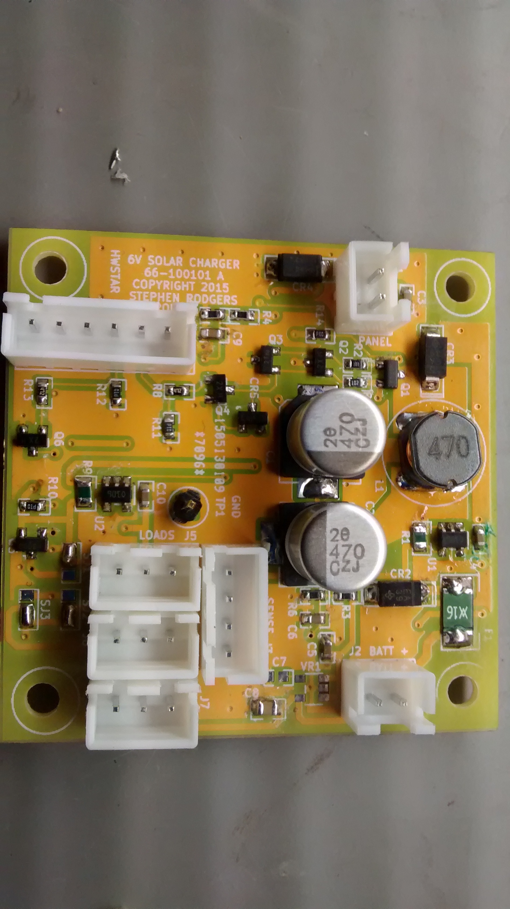
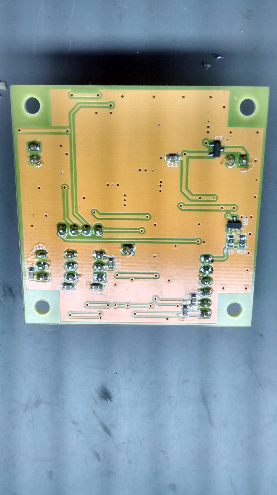

***6volt-5W-solar-cc***

**Introduction**

This is a solar charge controller for use with 5 watt 6 volt solar panels.
The project use a custom printed circuit board for the charge controller
power management electronics, and requires an external Arduino pro mini
to run the control firmware.

Setup in the lab:

The power management board design has the following features:

* PV input transient and reverse polarity protection
* Sensing for PV input voltage, converter output current, load current,
and battery voltage.
* PV Back feed protection using a dedicated MOSFET.
* PTC and reverse polarity protection on the battery connector.
* 3 sets of 3 pin connectors for loads. 
* 4 pin sense connector for current and voltage sensing to the Arduino
* 6 pin control connector for control signals from the Arduino
* Dedicated MOSFET for load switching.
* Switched and unswitched load configuration using solder jumpers.
* Double sided circuit board 5cm X 5cm

Front view of board:

Rear view of board:

**Firmware**

The firmware is hosted as a separate project on my github pages.
The project is named fw-6volt-5W-solar-cc. For more details on
the firmware features, please visit the firmware page.

**Python/tkinter utility**

A Python/tkinter utility is available to download variables from the
charge controller in real time using a Bus Pirate and an I2C interface.
This is also hosted on my github pages under 
chargectrlr-python-buspirate.

**License**

CC-BY-SA

**Disclaimer**

This project uses a lead acid battery. Please observe all safety 
precautions listed on the battery. Enclose this project in a metallic
fireproof enclosure. Keep internal temperatures within the operating
limits of the battery. Not responsible for life, or loss of property
under any circumstance!

